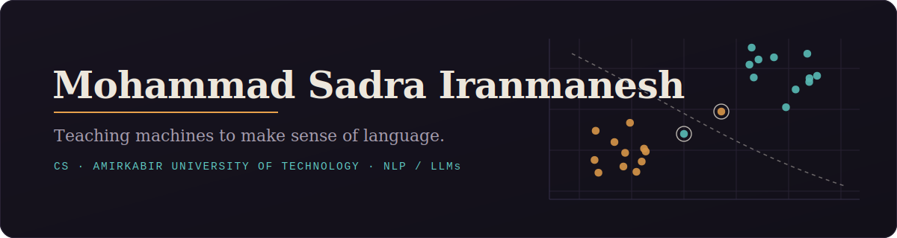

  

**Computer Science · Amirkabir University of Technology (Tehran Polytechnic)**

NLP and large language models — and the data work that makes them useful.

<a href="https://www.linkedin.com/in/sadra-iranmanesh-36607b325">LinkedIn</a> &nbsp;·&nbsp;
<a href="mailto:sadrairan@aut.ac.ir">sadrairan@aut.ac.ir</a> &nbsp;·&nbsp;
<a href="mailto:sadrairanmanesh2564@gmail.com">sadrairanmanesh2564@gmail.com</a>

---

### About

Computer Science student at Amirkabir University of Technology. An unapologetic nerd for
artificial intelligence, natural language processing, and large language models — with a
working interest in software development, data integration, and data engineering. I like
the part of the job where careful work decides whether a model actually understood the
text, or just memorized its surface.

### Currently

- **Research Assistant** — NORC Lab (Novelties, Optimization &amp; Redesigning of Cities), MCS faculty, AUT — with Dr. Mehdi Ghatee
- **Researcher &amp; Marketing Manager** — *Halgheh*, the MCS student journal at AUT
- **B.Sc. in Computer Science**, AUT — most recent semester GPA **4.0 / 4.0**, faculty-ranked

### Focus

Large language models &nbsp;•&nbsp; Natural language processing &nbsp;•&nbsp; Applied NLP &amp; data

### Selected work

- **House price prediction · District 4, Tehran** — a deep-learning regression model on tabular features
- **Rock-Paper-Scissors gestures** — a CNN image classifier, end-to-end in PyTorch

### Toolkit

  
  
  
  
  
  

### Education

- **Amirkabir University of Technology** — B.Sc. Computer Science · Oct 2024 – Present
- **Sampad** (National Organization for Development of Exceptional Talents) — Diploma, Mathematics &amp; Physics · 19.48 / 20

---

Open to research collaborations and MSc opportunities. Reach me any time.

